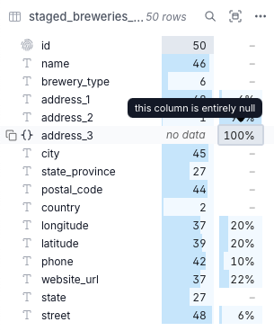

Overview
========

I was asked to build a data pipeline to fetch data from an API and store it in a data lake.

Project Instructions
====================

We could choose an orchestration tool and a language.
We were asked to build a pipeline that created a data lake following the medallion architecture.

Main Decisions
==============

I chose to build an `Airflow` workflow using `Astronomer Cosmos` because it nicely integrates with `dbt`. Using `dbt` I can build models, a data lineage, and keep every transformation and stage as code, which can be versioned.

`Astronomer Cosmos` "zoom in" in each `airflow` task and we also gain control by visualizing its logs on the Airflow UI itself.

Regarding the data itself, the main decision took place in the silver layer. We should partition the data based on the brewery location, I chose to partition it based on the `state` column. That is because, after analyzing the data stats, `city` was too granular, while `country` was an overkill. `state` provided a somewhat skewed distribution, which could cause problems when the data grow. But for now it was the better decision. See the pictures below to gain an understanding.

Strategy
========

The data fetched from the API was saved as `json` in raw format. That data was then ingested in `DuckDB`, using its reader to dynamically infer the schema of the data. In `DuckDB` I created a temporary table and saved it as a `Delta Table`. This `Delta Table` was used, at this point (before the bronze layer) to avoid ingestion or reading json files with `dbt`. After that, I proceeded with the instructions gave.

I should note that I dropped the `address_1` and `address_3` (to be revised later with clients or managers) because the first was equal to another field, the `street` field, and the latter was all `null`.

Project Contents
================

Your Astro project contains the following files and folders:

- dags: This folder contains the Python files for your Airflow DAGs. By default, this directory includes one example DAG:
    - `example_astronauts`: This DAG shows a simple ETL pipeline example that queries the list of astronauts currently in space from the Open Notify API and prints a statement for each astronaut. The DAG uses the TaskFlow API to define tasks in Python, and dynamic task mapping to dynamically print a statement for each astronaut. For more on how this DAG works, see our [Getting started tutorial](https://www.astronomer.io/docs/learn/get-started-with-airflow).
- Dockerfile: This file contains a versioned Astro Runtime Docker image that provides a differentiated Airflow experience. If you want to execute other commands or overrides at runtime, specify them here.
- include: This folder contains any additional files that you want to include as part of your project. It is empty by default.
- packages.txt: Install OS-level packages needed for your project by adding them to this file. It is empty by default.
- requirements.txt: Install Python packages needed for your project by adding them to this file. It is empty by default.
- plugins: Add custom or community plugins for your project to this file. It is empty by default.
- airflow_settings.yaml: Use this local-only file to specify Airflow Connections, Variables, and Pools instead of entering them in the Airflow UI as you develop DAGs in this project.

Deploy Your Project Locally
===========================

1. Start Airflow on your local machine by running 'astro dev start'.

This command will spin up 4 Docker containers on your machine, each for a different Airflow component:

- Postgres: Airflow's Metadata Database
- Webserver: The Airflow component responsible for rendering the Airflow UI
- Scheduler: The Airflow component responsible for monitoring and triggering tasks
- Triggerer: The Airflow component responsible for triggering deferred tasks

2. Verify that all 4 Docker containers were created by running 'docker ps'.

Note: Running 'astro dev start' will start your project with the Airflow Webserver exposed at port 8080 and Postgres exposed at port 5432. If you already have either of those ports allocated, you can either [stop your existing Docker containers or change the port](https://www.astronomer.io/docs/astro/cli/troubleshoot-locally#ports-are-not-available-for-my-local-airflow-webserver).

3. Access the Airflow UI for your local Airflow project. To do so, go to http://localhost:8080/ and log in with 'admin' for both your Username and Password.

You should also be able to access your Postgres Database at 'localhost:5432/postgres'.

Deploy Your Project to Astronomer
=================================

If you have an Astronomer account, pushing code to a Deployment on Astronomer is simple. For deploying instructions, refer to Astronomer documentation: https://www.astronomer.io/docs/astro/deploy-code/

Contact
=======

The Astronomer CLI is maintained with love by the Astronomer team. To report a bug or suggest a change, reach out to our support.
